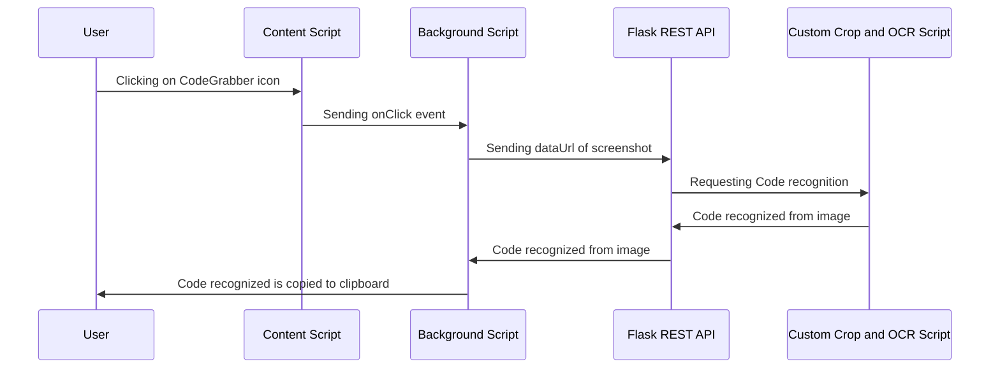

# CodeGrabber

**Tesseract based chrome extension which performs code recognition from Youtube videos.**

## Description/Features
Developers often watch Youtube tutorials to learn a variety of programming concepts. Unfortunately, the coding materials in the video are sometimes not provided by the uploader, meaning viewers often have to manually type out the code as they follow along, leading to a longer amount of time spent doing tedious code mirroring. 
**CodeGrabber** is a chrome extension which addresses this issue. With a click of a button, users can copy the code in their Youtube video player to their clipboard, leading to more time learning and less time copying. 

Note: Since not all Youtube videos will have a similar IDE visually and Tesseract is not the best OCR service, there can be some minor errors in the code recognized. However, these are often just spelling mistakes and are easily fixed.

## Demo
Heres the Youtube video. The screenshot was captured by clicking the CodeGrabber chrome extension icon.

And here's the code that was recognized and copied to the clipboard. 
` import tensorflow as tf` 
`from tensorflow.keras.models import Sequential` 
`from tensorflow.keras.layers import Dense, Dropout, [LSTM` 
`mnist = tf.keras.datasets.mnist` 
`(x_train, y_train)|,(x_test, y_test) = mnist.load_data()` 
`print(x_train. shape)` 
`print(x_train)` 

## Installation and Setup

**REST Api Setup**
First, clone the repository to your local machine by using the command `git clone https://github.com/deetsadi/CodeGrabber.git`

Next, navigate to the project directory in the terminal/command line and type `source env/bin/activate`. Install the python dependencies using `pip install -r requirements.txt`. 

Then, type `cd api` and start the flask server by running `python app.py`.

**Chrome setup**
Open a new chrome window and type `chrome://extensions` in the address bar. Ensure that "Developer Mode" is enabled in the top right of the page. 
Click "Load unpacked" in the top left of the page and click on the CodeGrabber project folder when prompted to choose a folder. If you don't see the CodeGrabber icon added to your extensions bar (next to address bar), just pin it. 

Thats it, now just click on the CodeGrabber icon whenever you wish to copy code from a video.

## How does it work?
**Logic**
CodeGrabber works by accessing a Python REST Api built using Flask from the JS backend of the chrome extension. This is because Python is the most popular language for ML and data processing, and so extracting data from the screenshots is easier.
The screenshot is sent in the form of a dataUrl (base64 string) in the Api request. Python recieves this dataUrl and writes it to a file. It then performs a complex cropping script to isolate only the code in the image, since this is only a portion of the whole screenshot. This is done using a variety of image processing and text detection techniques. 
Finally, the text is extracted using Tesseract and sent back to JS, where it is copied to the user's clipboard. A simple `Ctrl+V` pastes the code wherever the user would like.

**Event Pipeline:**

